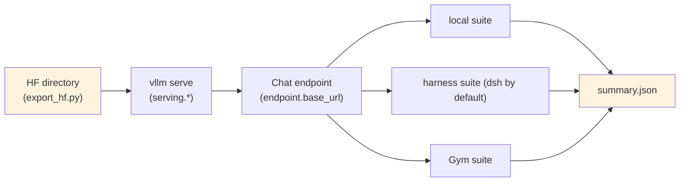

# Stage 3: Evaluation

Serve the model with **vLLM** and run three suites: 1) the **harness suite** (DeepSeek Harness runs the
benchmark list directly, without Gym); 2) **NeMo Gym** benchmarks (one of the harness's hosts); 3) a
**local suite** that needs no Gym (plain HTTP + local scoring, runnable on a single box). Evaluation only
reads the model; the serving layer is always `vllm serve`, and the harness consumes only
`endpoint.base_url`.

## Overview

| Component | Description |
|-----------|-------------|
| `eval.py` | Entry point: `--profile`, `--suite`, `--dry-run`, `--set`; starts `vllm serve` → runs the benchmarks → writes `summary.json` |
| `test_train.py` | Preflight: config parsing, the `vllm serve` command, the vllm CLI, the model directory, GPU, imports |
| `setup_env.sh` | Installs the harness / Gym stack (needs the target environment; `harness.py`'s preflight reports what is missing) |
| `config/` | `default.yaml` (production) / `tiny.yaml` (cloud tiny) / `tiny_local.yaml` (offline local) |

| Suite (`--suite`) | Needs | Description |
|-------------------|-------|-------------|
| `harness` | the harness containers and benchmark assets | runs the `bench.benchmarks` list through `harness.command`, without Gym |
| `gym` | a NeMo Gym checkout and benchmark assets (`setup_env.sh`) | Gym is one of the harness's hosts, running the same benchmark names |
| `local` | local capability sets + long-context corpora | no external dependency: start `vllm serve` and hit a local benchmark set over HTTP (sampled math / code / instruction-following plus long-document retrieval), scored locally by rules |
| `all` | all of the above | the default in `config/default.yaml` |

Key sections of `config/default.yaml`: `serving:` (`model_path` / `tp` / `dp` / `kv_cache_dtype` /
`max_model_len` / `reasoning_parser` / `tool_call_parser` / `speculative_config` — the geometry ships 3
shared MTP layers, so speculative decoding becomes available once vLLM supports it), `endpoint:` (the
chat-compatible `base_url` / `model` / `max_tokens` / `temperature`), `bench:` (one benchmark list shared
by the harness and Gym), `harness:` ([`../harness.py`](../harness.py)'s wiring, DeepSeek Harness by
default), `local:` (corpus roots for the capability sets and the long-context suite).

## Quick Start

```bash
python test_train.py                       # preflight (does not actually start a server)
python eval.py --dry-run                   # print the vllm serve + benchmark commands
python eval.py --profile tiny              # tiny profile: one GPU, small model, short sequences
python eval.py --set serving.model_path=<ckpt>   # point at the checkpoint to evaluate
```

The server can also run standalone (common outside evaluation):

```bash
vllm serve <ckpt> --served-model-name shensi --port 8000 --tensor-parallel-size 8 \
  --max-model-len 1048576 --kv-cache-dtype fp8
```

When an endpoint is already up elsewhere, pass `--no-serve` and point `endpoint.base_url` at it;
`--base-url` / `--model` / `--model-path` / `--limit` / `--out` are quick overrides of the corresponding
config entries.

## Benchmarks and judging

| Benchmark | Judging | Notes |
|-----------|---------|-------|
| Math / science | local problem set + rule scoring (numeric / string matching) | same source as the RLVR verifier, keeping training and evaluation aligned |
| Code | unit tests (sandboxed) | soft-label scoring when no tests exist |
| Instruction following | structured-output validity + rules | same setup as [`../stage2_rl/stage3_align`](../stage2_rl/stage3_align/README.md) |
| Long-document retrieval (MRCR-style) | all needles in order (wrong order or a missing needle scores 0) | items come from `stage3_longctx/build_longctx.py --step mrcr`'s `mrcr_eval.jsonl`, sharing needles with the training segment |
| harness / Gym benchmarks | the host's own judging | for alignment with published numbers; local runs only do the preflight unless installed |

## Verification

1. **Preflight PASS** (vllm CLI, serve command, GPU, imports);
2. After startup `/v1/models` lists `shensi`, and a short prompt generates normally (neither garbage nor
   empty);
3. Benchmark scores agree with the training-stage criteria (math scoring matches the RLVR verifier, say);
4. Repeated evaluation of one checkpoint stays within the benchmark's noise (with sampling temperature
   fixed it should be tiny).

**Local verification** (WSL2 + RTX 5080 16G, single GPU):

```bash
# 1) local offline profile (tiny local model + post-training sample set)
python eval.py --profile tiny_local --limit 5
# 2) connect the previous artifact: export HF first, then let vLLM serve it
python -m shensi.recipes.shensi.train.export_hf \
    --ckpt $SHENSI_FS/shensi/ckpt/stage1_sft_debug --out $SHENSI_FS/shensi/models/sft-hf --tiny
python eval.py --profile tiny_local --limit 5 --model-path $SHENSI_FS/shensi/models/sft-hf
```

- Both runs passed (start `vllm serve` → probe → run 5 local items → write `summary.json`); the second
  serves **weights exported from the SFT checkpoint**;
- The **scores are meaningless** (tiny model + minimal corpora + substring rewards); they only prove the
  "serve → endpoint → score → summarize" chain;
- The cloud profile `--profile tiny` uses the production tokenizer / weights and cloud capability sets;
  the Gym suite is not installed locally (`SHENSI_GYM`).

## Artifact Lineage



## Limitations

1. External dependencies (harness containers, the Gym host, benchmark assets) need the target
   environment; the local preflight reports item by item whether each is present, missing and how to
   install it. **The vLLM serving layer is unchanged**: the harness consumes only `endpoint.base_url`, so
   `serving.*` and the mcore side are unaffected;
2. `serving.model_path` in `config/default.yaml` is a placeholder (a checkpoint path on the production
   machine); local runs need `--set serving.model_path=<local ckpt>`;
3. The long-context suite uses **MRCR-style** multi-needle items built from this repository's own corpora,
   not the official MRCR dataset — be explicit about that when comparing numbers across models.

## Previous Stages

- [Stage 0: Pretraining](../stage0_pretrain/README.md) — dense backbone, DSA, long context
- [Stage 1: SFT](../stage1_sft/README.md) — instruction tuning
- [Stage 2: RL](../stage2_rl/README.md) — RLVR / agentic / alignment / world model
