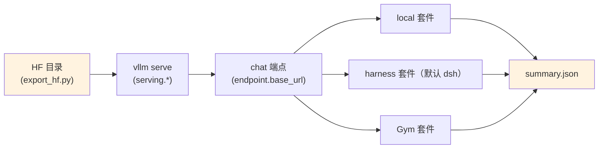

# Stage 3: 评测

用 **vLLM 起服务**，跑三套评测：① **harness 套件**（默认 DeepSeek Harness 直接跑基准清单，不经 Gym）；
② **NeMo Gym** 基准（harness 的宿主之一）；③ 不依赖 Gym 的 **local 套件**（纯 HTTP + 本地打分，单机就能跑）。
评测只读模型、不训练；服务层始终是 `vllm serve`，harness 只消费 `endpoint.base_url`。

## 总览

| 组件 | 做什么 |
|------|--------|
| `eval.py` | 入口：`--profile` 选档、`--suite` 选套件、`--dry-run`、`--set`；起 vLLM 服务 → 跑基准 → 汇总 `summary.json` |
| `test_train.py` | 集成预检：配置解析、`vllm serve` 命令、vllm CLI、模型目录、GPU、import |
| `setup_env.sh` | 装 harness / Gym 那套外部依赖（需要目标环境；`harness.py` 的预检会报缺什么） |
| `config/` | `default.yaml`（全量档）/ `tiny.yaml`（云端极小）/ `tiny_local.yaml`（本机离线） |

| 套件（`--suite`） | 需要什么 | 说明 |
|------|---------|------|
| `harness` | harness 的容器与基准资产 | 不经 Gym，按 `harness.command` 直接跑 `bench.benchmarks` 里的清单 |
| `gym` | NeMo Gym 的检出与基准资产（`setup_env.sh`） | Gym 是 harness 的宿主之一，跑同一批基准名字 |
| `local` | 本地能力集 + 长上下文语料 | 不依赖外部：起 `vllm serve` 后用 HTTP 打一批本地基准（数学/代码/指令遵循的抽样集 + 长文检索），本地规则打分 |
| `all` | 以上 | `config/default.yaml` 的默认值 |

`config/default.yaml` 的关键段：`serving:`（`model_path` / `tp` / `dp` / `kv_cache_dtype` / `max_model_len` /
`reasoning_parser` / `tool_call_parser` / `speculative_config`——几何带 3 层共享 MTP，vLLM 侧支持后可开投机解码）、
`endpoint:`（chat 兼容端点的 `base_url` / `model` / `max_tokens` / `temperature`）、`bench:`（harness 与 Gym
共用同一批基准名）、`harness:`（[`../harness.py`](../harness.py) 的统一接线，默认 `dsh`）、
`local:`（能力集与长上下文套件的语料根）。

## 快速开始

```bash
python test_train.py                       # 集成预检（不真正起服务）
python eval.py --dry-run                   # 只打印 vllm serve + 评测命令
python eval.py --profile tiny              # 极小档：单卡、小模型、短序列
python eval.py --set serving.model_path=<ckpt>   # 指定要评测的 ckpt
```

服务本身可以单独起（评测之外也常用）：

```bash
vllm serve <ckpt> --served-model-name shensi --port 8000 --tensor-parallel-size 8 \
  --max-model-len 1048576 --kv-cache-dtype fp8
```

端点在别处已经起好时用 `--no-serve`（`endpoint.base_url` 指过去）；`--base-url` / `--model` /
`--model-path` / `--limit` / `--out` 都是对应配置项的快捷覆写。

## 基准与判分口径

| 基准 | 判分 | 说明 |
|------|------|------|
| 数学 / 科学 | 本地题库 + 规则判分（数字 / 字符串匹配） | 与 RLVR 的 verifier 同源，便于训练-评测对齐 |
| 代码 | 单测（沙箱执行） | 没有单测的用软标签判分 |
| 指令遵循 | 结构化输出合法率 + 规则 | 与 [`../stage2_rl/stage3_align`](../stage2_rl/stage3_align/README.md) 同口径 |
| 长文检索（MRCR 类） | 按出现顺序全对（顺序错、缺一条都是 0） | 题面来自 `stage3_longctx/build_longctx.py --step mrcr` 的 `mrcr_eval.jsonl`，与训练段共用同一批针 |
| harness / Gym 基准 | 宿主自己的判分 | 与公开数字对齐用；本机没装只做预检 |

## 验证

1. **集成预检 PASS**（vllm CLI、serve 命令、GPU、import）；
2. 服务起来后 `/v1/models` 有 `shensi`；短 prompt 生成正常（不是乱码、不是空）；
3. 各基准的分数与训练阶段的判据对得上（例如数学口径与 RLVR 的 verifier 一致）；
4. 同一 ckpt 多次评测的方差在基准的噪声范围内（采样温度固定时应当很小）。

**本机实跑记录**（WSL2 + RTX 5080 16G，单卡）：

```bash
# ① 本机离线档（本地 tiny 模型 + post-training 样例集）
python eval.py --profile tiny_local --limit 5
# ② 接前序产物：先导出 HF，再让 vLLM 服务它
python -m shensi.recipes.shensi.train.export_hf \
    --ckpt $SHENSI_FS/shensi/ckpt/stage1_sft_debug --out $SHENSI_FS/shensi/models/sft-hf --tiny
python eval.py --profile tiny_local --limit 5 --model-path $SHENSI_FS/shensi/models/sft-hf
```

- 两次都跑通（起 `vllm serve` → 探活 → 打 local 套件 5 条 → 写 `summary.json`），第二种是
  **从 SFT ckpt 导出的权重**起服务；
- 分数**没有意义**（极小模型 + 极简语料 + 子串式奖励），只证明「服务 → 端点 → 打分 → 汇总」这条链路通；
- 云端档 `--profile tiny` 用生产的 tokenizer/权重与云端能力集；Gym 套件本机没装（`SHENSI_GYM`）。

## 产物链路



## 局限

1. 外部依赖（harness 容器、Gym 宿主、基准资产）都要目标环境；本机的预检会逐项报「有没有、缺什么、怎么装」。
   **vLLM 服务层不变**：harness 只消费 `endpoint.base_url`，`serving.*` 里的参数与 mcore 侧完全不受影响；
2. `config/default.yaml` 里的 `serving.model_path` 是占位（生产机上的 ckpt 路径），
   本机跑要 `--set serving.model_path=<本机 ckpt>`；
3. 长文套件用的是 **MRCR 类**多针检索，题面来自本仓库自己的语料、不是官方 MRCR 数据集，
   跨模型比数字时要说清楚。

## 前序阶段

- [Stage 0: 预训练](../stage0_pretrain/README.md) — 稠密主干、DSA、长上下文
- [Stage 1: SFT](../stage1_sft/README.md) — 指令微调
- [Stage 2: RL](../stage2_rl/README.md) — RLVR / agentic / 对齐 / 世界模型
