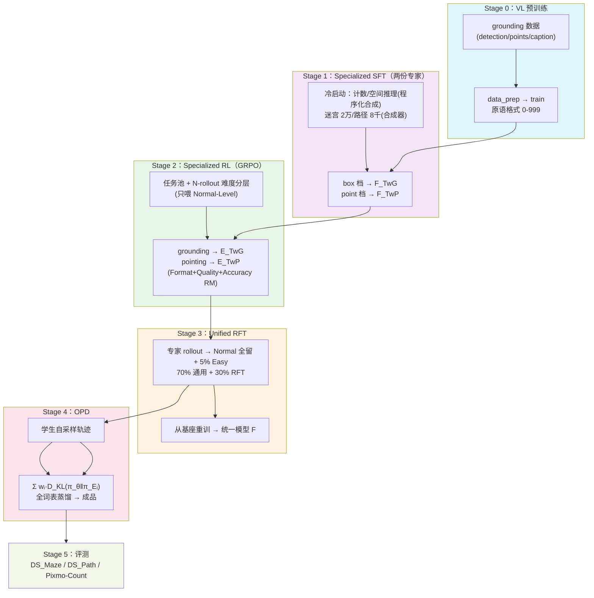

# shensi_vl：Thinking with Visual Primitives 训练配方

对齐 DeepSeek-AI《Thinking with Visual Primitives》的完整流水线：**在 DSV4F 权重之上**，
预训练赋予视觉原语输出 → box/point 两个专家（SFT → GRPO）→ 统一 RFT → 在线蒸馏。
图像侧用 Kimi K3 的 processor/image_processor（moonshotai/Kimi-K3 发布件）；文本侧
tokenizer 与 shensi 完全一致（DSV4F，`$SHENSI_TOKENIZER`），只增量加 7 个特殊 token。

## 模型

LLaVA 式组合（论文 §2.2）：

| 件 | 来源 | 说明 |
| --- | --- | --- |
| 语言骨干 | DSV4F（HF 目录，`$SHENSI_FS/models/DeepSeek-V4-Flash-0731`） | 284B-A13B MoE；与 shensi RL 的 model.path 同一份权重 |
| 视觉塔 | 任意 HF ViT（`$SHENSI_VL_VISION`，默认 `$SHENSI_FS/models/Kimi-K3-ViT`） | 论文的 DeepSeek-ViT 未开源，用与 Kimi image_processor 同 patch 口径（14×14）的开源 ViT 替代 |
| projector | LayerNorm→Linear→GELU→Linear | 视觉特征 → LLM hidden |
| 图像进出 | Kimi K3 image_processor（`$SHENSI_VL_PROCESSOR`，本地镜像优先） | patch 14、merge 2×2、mean/std 0.5；`make_image_prompt(w,h)` 算图像 token 数 |
| tokenizer | DSV4F + 7 个增量特殊 token | `<\|ref\|>/<\|/ref\|>/<\|box\|>/<\|/box\|>/<\|point\|>/<\|/point\|>/<\|image_pad\|>`；基座词表不动，副本在 `$SHENSI_FS/shensi/models/shensi-vl-tok` |

文本编码沿用 shensi stage1_sft 的官方 `encoding_dsv4.py`（DSv4 chat 模板 + thinking 模式），
loss 只算 assistant 段、`<think>` 脚手架与图像位屏蔽——与基座 SFT 完全同口径。

## 训练流水线（论文 §2.3–2.5 → 本配方 stage）



| Stage | 目录 | 论文章节 | 产物 |
| --- | --- | --- | --- |
| 0 预训练 | [stage0_pretrain/](./stage0_pretrain/) | §2.3 | 基础原语能力的 VL 基座 |
| 1 专项 SFT | [stage1_sft/](./stage1_sft/)（`default`=box / `point`） | §2.4 + §2.5.1 | F_TwG / F_TwP |
| 2 专项 RL | [stage2_rl/](./stage2_rl/)（grounding / pointing） | §2.5.2 | E_TwG / E_TwP |
| 3 统一 RFT | [stage3_rft/](./stage3_rft/) | §2.5.3 | 统一模型 F |
| 4 在线蒸馏 | [stage4_opd/](./stage4_opd/) | §2.5.4 | 成品模型 |
| 5 评测 | [stage5_eval/](./stage5_eval/) | §3 | summary.json |

## 数据（论文口径 → HF 开源替代；配比对齐、绝对量按本地预算缩）

落地根：`$SHENSI_FS/datasets/llm/{pre,post}-training/<name>`（下载清单
[stage0_pretrain/config/data_prep/download_manifest.json](./stage0_pretrain/config/data_prep/download_manifest.json)）。

| 用途 | HF 数据集 | 论文对应 |
| --- | --- | --- |
| 通用图文（预训练 60% + SFT 的 70% 部分） | `lmms-lab/LLaVA-OneVision-Data` | 网络图文（不合成改写） |
| 框 grounding | `detection-datasets/coco`、`surenreddy/object365`、`sshao0516/CrowdHuman`、`PaDT-MLLM/RefCOCO` | COCO[17]、Objects365[29]、CrowdHuman[28]、GRIT |
| 点 grounding | `allenai/pixmo-points`（+ `pixmo-point-explanations` 可选） | PixMo-Points[4] |
| 计数 RL / 冷启动 | `allenai/pixmo-count`、`silveroupti/VisDrone` + 上面的密集检测集 | PixMo-Count、VisDrone[35] 等 |
| 空间推理 / 细粒度计数 | `lmms-lab/GQA` + `Voxel51/GQA-Scene-Graph`（`--join-gqa` 合并） | GQA[10]、CLEVR[13] |
| 迷宫导航 / 路径追踪 | **程序化合成**（`common/synth_maze.py` / `synth_trace.py`，同论文算法与风格随机化） | §2.4.3 / §2.4.4 |

论文里"MLLM 合成思维链 + 严格校验"在本配方换成**程序化合成**：思维链直接从标注元数据生成
（三段式计数、sequential scan、DFS 探索解说），每个原语天然严格对齐标注——校验零噪声，
代价是思维链风格比 MLLM 生成的单一。

## 快速开始

```bash
# 全链路冒烟（不需要任何真实语料/权重下载，tiny LM + 随机 ViT + 合成假数据）
python -m shensi.recipes.shensi_vl.stage0_pretrain.test_train
python -m shensi.recipes.shensi_vl.stage1_sft.test_train

# 真实数据（先落数据集，见 download_manifest.json）
cd stage0_pretrain && python data_prep.py --discover
python data_prep.py --prepare --limit 512
python train.py --profile debug

cd ../stage1_sft
python data_prep.py --discover
python data_prep.py --join-gqa            # GQA 图像×场景图（一次性）
python data_prep.py --prepare
python train.py --profile debug           # tiny + 真数据
python train.py --profile default         # F_TwG；--profile point → F_TwP

cd ../stage2_rl
python data_prep.py --family grounding --rollouts 8     # 难度分层
cd stage1_grounding && python train.py --profile default  # E_TwG
cd ../stage2_pointing && python train.py --profile default # E_TwP

cd ../../stage3_rft
python data_prep.py --rollouts 8
python train.py --profile default          # 统一模型 F

cd ../stage4_opd
python data_prep.py                        # 学生自采样
python train.py --profile default          # 成品

cd ../stage5_eval
python eval.py --suite all --n 500
```

环境变量（都有默认，见 [common/paths.py](./common/paths.py)）：

| 变量 | 默认 | 含义 |
| --- | --- | --- |
| `SHENSI_TOKENIZER` | `$SHENSI_FS/models/DeepSeek-V4-Flash-0731` | DSV4F tokenizer（与 shensi 一致，不修改） |
| `SHENSI_VL_TOKENIZER` | `$SHENSI_FS/shensi/models/shensi-vl-tok` | +7 特殊 token 的扩展副本（首次训练自动生成） |
| `SHENSI_VL_PROCESSOR` | 本地 `$SHENSI_FS/models/Kimi-K3`，否则 `moonshotai/Kimi-K3` | Kimi K3 processor / image_processor |
| `SHENSI_VL_VISION` | `$SHENSI_FS/models/Kimi-K3-ViT` | 视觉塔（HF ViT 目录） |
| `SHENSI_VL_LLM` | `$SHENSI_FS/models/DeepSeek-V4-Flash-0731` | 语言骨干 HF 目录 |
| `SHENSI_VL_TINY_LLM` | `Qwen/Qwen3-0.6B` | 冒烟档的语言骨干 |
| `SHENSI_VL_QUALITY_URL` | 无 | Quality RM（GRM）判分端点；不配则中性跳过 |

## 验证

| 项 | 口径 |
| --- | --- |
| 结构 | 每 stage `test_train.py` / `--profile tiny` 跑通：加载 → 前向反传 → 存 ckpt（tiny LM + 随机 ViT + 假/合成数据） |
| 原语格式 | `common/primitives.py` 的解析/校验器被冷启动合成、Format RM、评测共用同一条实现 |
| 奖励 | `stage2_rl/reward.py --run-as-main` 自检：迷宫正/反例、计数衰减曲线 |
| 数据 | `data_prep.py --discover` 打落地列名；blend 字段名全部可配（对不上改 blend） |

## 与 shensi 基座的关系 / 已知限制

1. **复用**：`common/paths.py` 复用基座 `shensi.common` 的路径与配置合并；文本编码复用基座
   stage1_sft 的 `encoding_dsv4.py`（tokenizer 口径逐位一致）。
2. **训练循环**：基座的 mcore 管线是纯文本（SFTTokenizer 不吃图像），本配方的 PT/SFT/RFT/OPD
   走配方内 HF 循环（`common/train/train_loop.py`，torchrun DDP 可用），优化器用 AdamW ——
   基座的 AdaMuon 双腿优化器接在 mcore 侧，HF 模型吃不到。生产规模想回 mcore/verl，
   需要把 VL 组合注册成 Bridge/vLLM 架构（本配方未做）。
3. **规模**：论文 40M 框样本、数万亿 token、256K 序列；本配方各档是配比对齐的本地缩放版，
   `train_iters`/`n_maze` 等旋钮按预算放大。
4. **Quality RM** 需要外部 GRM 端点；不配则中性 1.0（等于只有 Format+Accuracy 两路在起作用）。
5. **评测**只覆盖论文基准的可本地复现子集；CountQA/SpatialMQA/CV-Bench 等公开基准待
   vLLM 注册后接基座 stage3_eval。
